# Hotel Rezervasyon Uygulaması

Bu uygulama, kullanıcıların otel arama, rezervasyon yapma ve tesis kurallarını görüntüleme gibi işlemleri kolaylıkla yapabilmesini sağlar.
**Siliconmade Academy Mobile Frontend eğitimi kapsamında bitirme projesi olarak yapılmıştır.**


---

## 📱 Özellikler
- Otel arama ve detaylı bilgi görüntüleme.
- Tarih, kişi sayısı ve oda sayısına göre otel araması.
- Otel detaylarını görüntüleme
- Kullanıcıya özel favori oteller ve rezervasyon yönetim sayfaları
- Kullanıcı dostu ve şık tasarım.

---

## 🚀 Başlangıç

### Gereksinimler
- **Node.js** (>=14)
- **Expo CLI**
- **Firebase** projesi (Authentication ve Firestore etkinleştirilmiş olmalı)

### Kurulum

1. Depoyu klonlayın:
   ```bash
   git clone <repository-url>
   cd <project-folder>

2. Bağımlılıkları yükleyin ve uygulamayı başlatın
   ```bash
   npx expo start
   
---

## 📂 Başlangıç
   ```bash
  src/
  ├── screens/            # Uygulamanın ekran bileşenleri
  ├── components/         # Yeniden kullanılabilir bileşenler (ör. Butonlar, Modallar)
  ├── services/           # Firebase ve diğer API servisleri
  ├── stores/             # Zustand ile global state yönetimi
  ├── navigation/         # Navigasyon yapılandırması
  ├── utils/              # Yardımcı fonksiyonlar ve sabitler
  └── assets/             # Uygulama içi görseller ve font dosyaları
   ```

---

## 🌟 Ekranlar
1. Ana Sayfa
Anasayfada arama kutusuyla beraber, önerilen otellere ait kartlar ve şehir kartları bulunur.
<p align="center">
  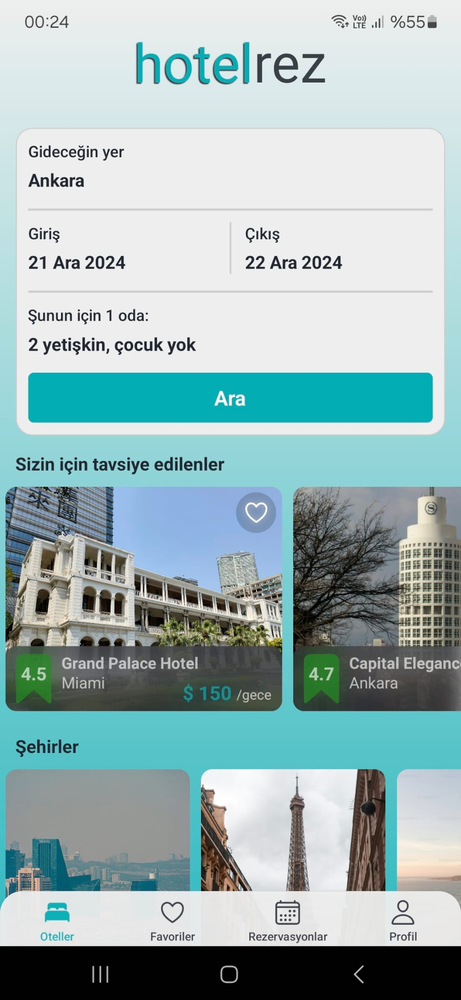
  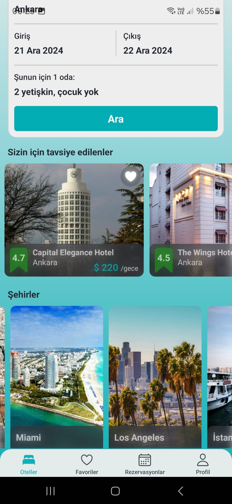
</p>

---

Kullanıcılar şehir, tarih ve kişi sayısına göre otel araması yapabilir.
"Gideceğin yer" input alanı bir modal aktive eder, açılan modalda autocomplete aktiftir. 
Text yazılmaya başlandığında, yazılan harflerle başlayan oteller ve şehirler filterelenir.
<p align="center">
  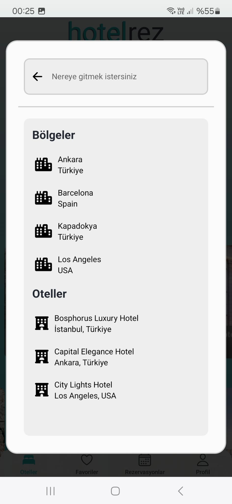
  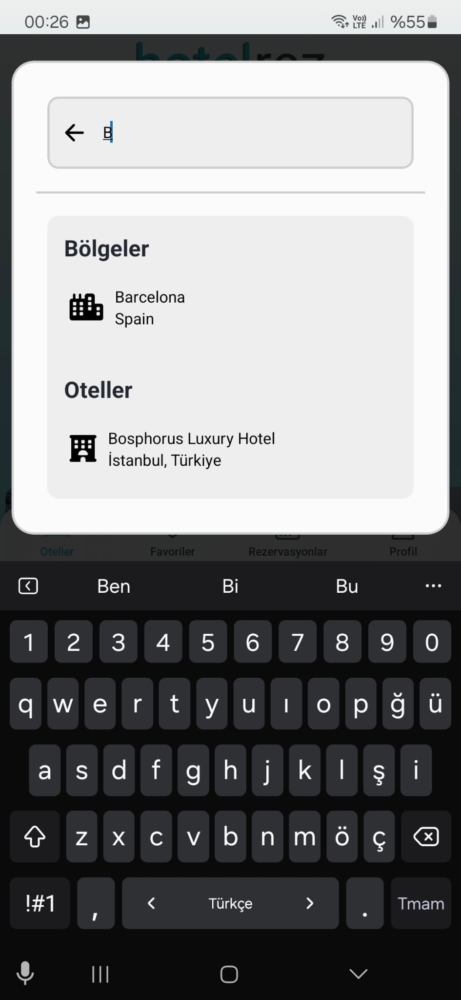
</p>

---

Giriş ve çıkış tarihlerine basıldığında tarih seçimi için modal açılır ve buradan DateTimePicker aracılığıyla iki tarih de seçilir.
<p align="center">
  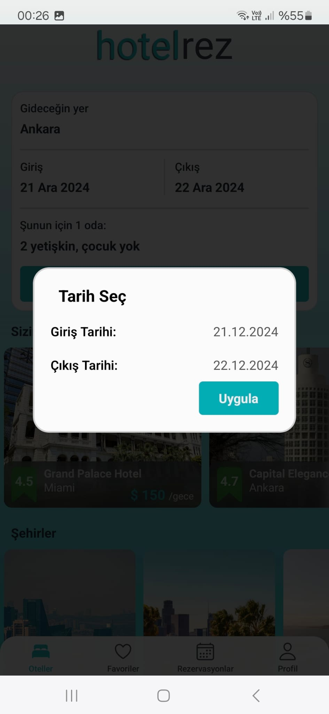
  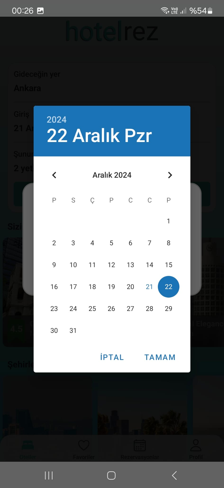
</p>

---

Bu ekran ise, otel rezervasyon uygulamasında oda ve konuk seçimlerinin yapıldığı modal ekranıdır. Kullanıcılar oda sayısını, yetişkin ve çocuk sayılarını belirleyebilir; ayrıca evcil hayvan dostu seçeneğini etkinleştirebilir. Seçimlerini tamamladıktan sonra "Uygula" butonuna basarak işlemi onaylayabilir.
<p align="center">
  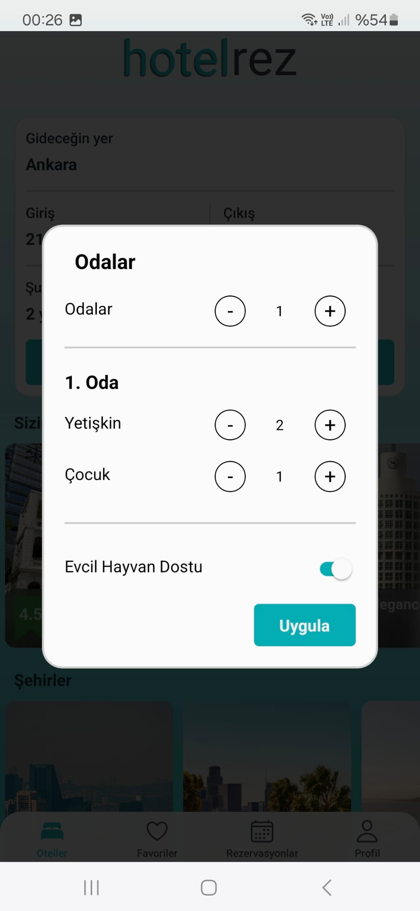
  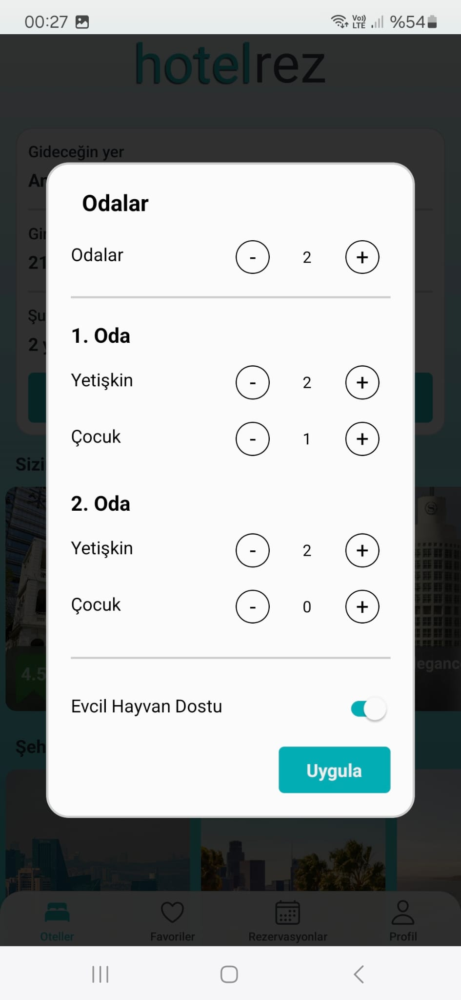
</p>

---

2. Arama Sonuçları

Bu ekran, otel arama sonuçlarının listelendiği sayfadır. Kullanıcılar, seçilen şehir ve tarih aralığına uygun otelleri görüntüleyebilir. Her otelin adı, fiyatı, puanı ve görseli sunulur. Favorilere eklemek için sağ üstteki kalp simgesi kullanılabilir.
Buradan header tıklandığında anasayfadaki arama kutusuna benzer içeriğe sahip bir modal açılır, arama kriterleri buradan düzenlenebilir.
  <p align="center">
    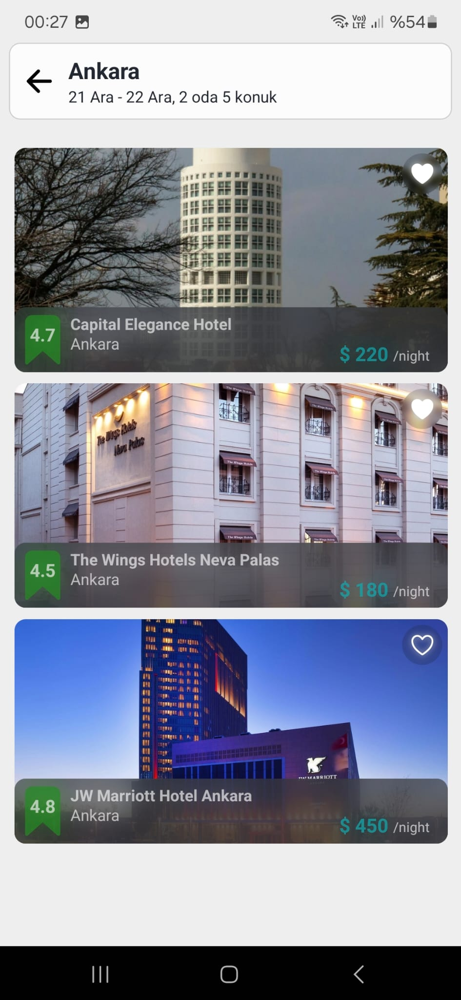
    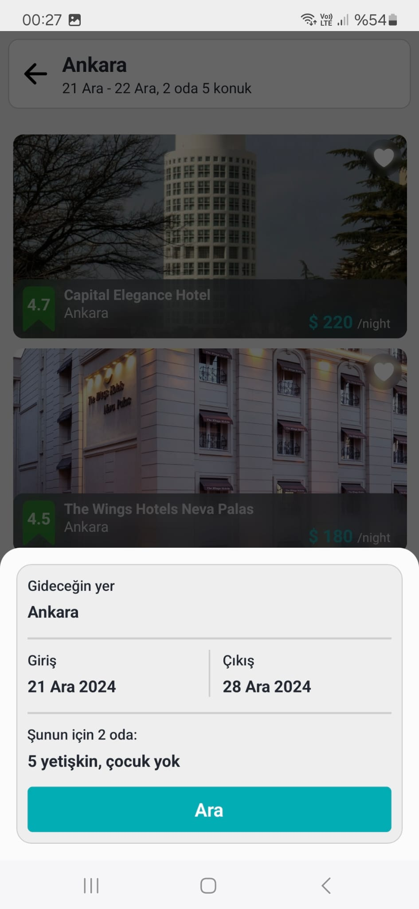
  </p>
  
---

3. Otel Detayları
otel detaylarının görüntülendiği sayfadır. Kullanıcılar otelin görsellerini, harita üzerindeki konumunu, adres bilgilerini ve otel hakkında genel açıklamaları inceleyebilir. Ayrıca, "Oda Seçimi" butonuna tıklayarak otel için uygun odaları görüntüleme ve rezervasyon sürecine devam etme imkanı sağlar.
 <p align="center">
    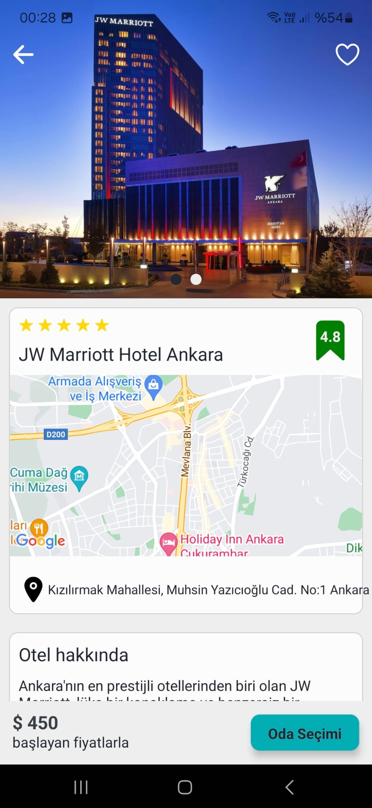
  </p>

  ---

4. Oda Seçimi
Bu ekran, seçilen oteldeki odaların listelendiği ve rezervasyon yapılabildiği ekranıdır. Kullanıcılar odaların fotoğraflarını, maksimum kişi kapasitesini, toplam fiyat bilgisini görüntüleyebilir ve "Rezervasyon Yap" butonuna tıklayarak rezervasyon işlemini başlatabilir. Her oda, ilgili detaylarıyla birlikte ayrı bir kartta sunulmaktadır.
 <p align="center">
    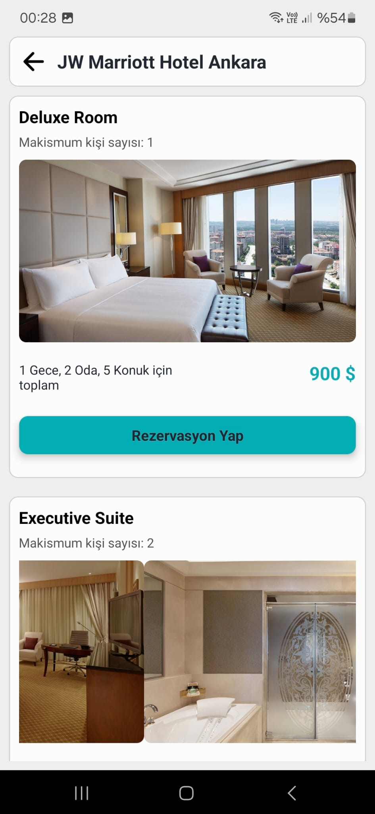
    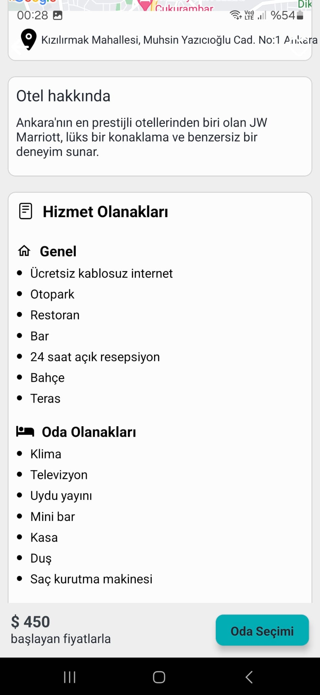
  </p>

---

5. Rezervasyon Detayları
Kullanıcıların seçilen oda için rezervasyon özetini görüntüleyebileceği ekrandır. Rezervasyonun toplam fiyatı, tesis kuralları ve diğer detaylar gösterilir.
Rezerve et butonuna basıldığında kullanıcının rezervasyonlarına eklendir ve veritabanında saklanır
  <p align="center">
    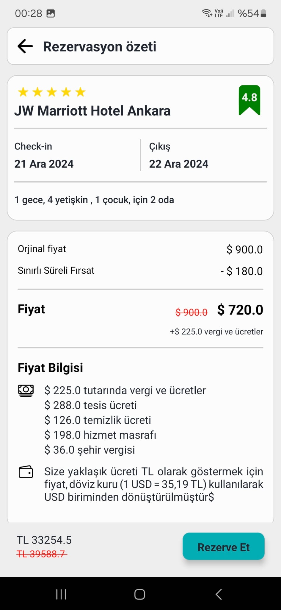
    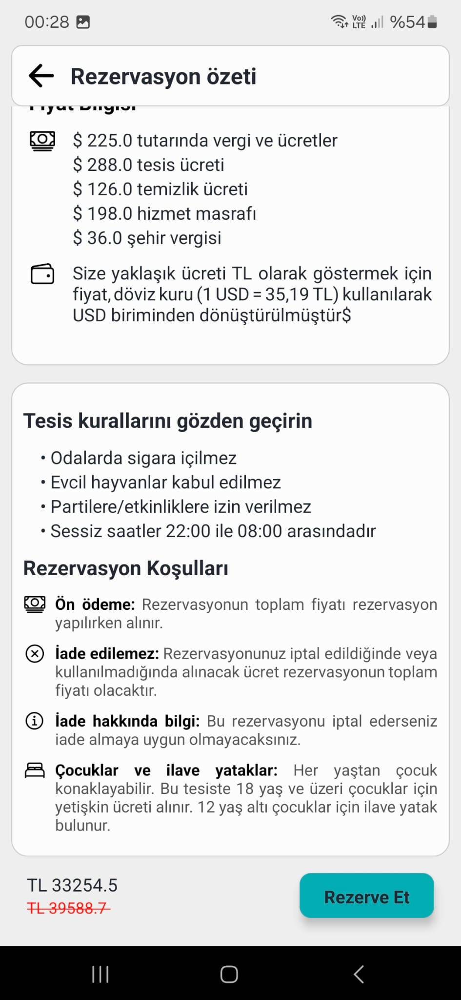
  </p>
  
---

6. Favori Oteller
Bu ekran, kullanıcıların favorilerine eklediği otelleri görüntüleyebileceği bir sayfadır. Kullanıcı oturum açmışsa favori oteller listesi detaylarıyla birlikte gösterilir. Eğer kullanıcı oturum açmamışsa, giriş yapması istenir.
  <p align="center">
    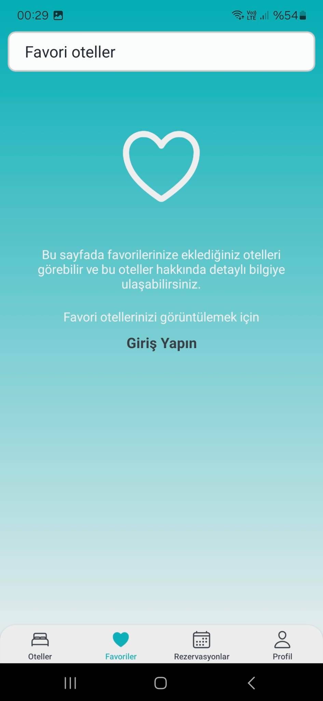
    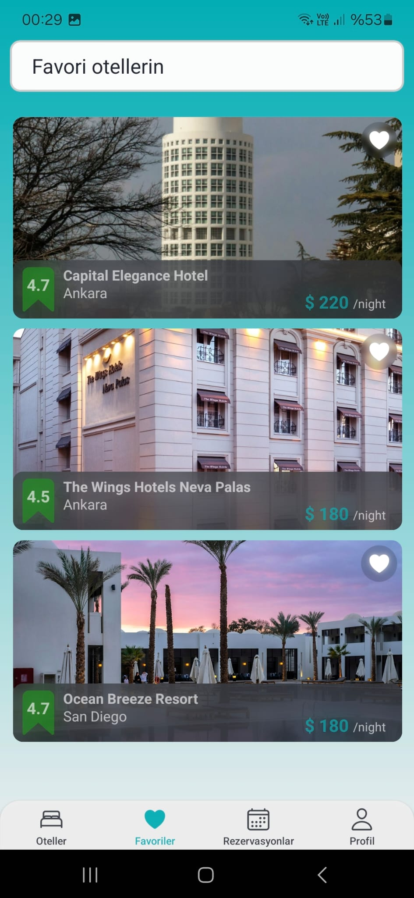
  </p>
  
---

7.Rezervasyonlar
Bu ekranda kullanıcılar yaptıkları otel rezervasyonlarını görebilir. Rezervasyonlar, otel adı, fiyat ve yer bilgisiyle listelenir. Kullanıcılar otel detaylarına kolayca erişebilir. Eğer giriş yapılmamışsa, kullanıcıyı giriş yapmaya yönlendiren bir mesaj gösterilir.
 <p align="center">
    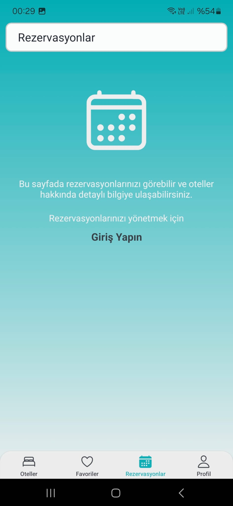
    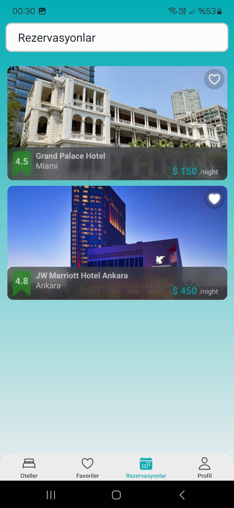
  </p>
  
---

8. Login ve Register

* Login Ekranı: Kullanıcıların e-posta adresi ve şifre ile giriş yapmasını sağlar. Google ile giriş yapma seçeneği de bulunmaktadır.
* Register Ekranı: Yeni kullanıcıların sisteme kaydolması için e-posta, şifre ve şifre onayı alanlarını içerir.
  <p align="center">
    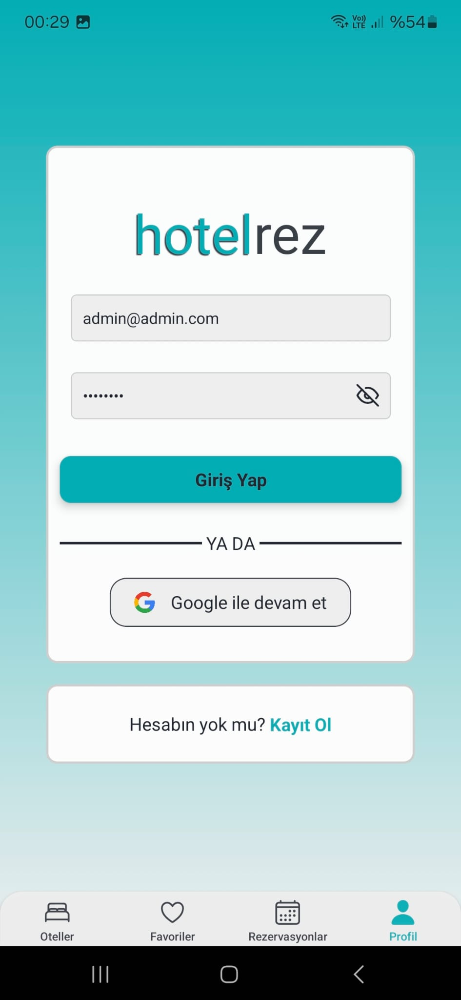
    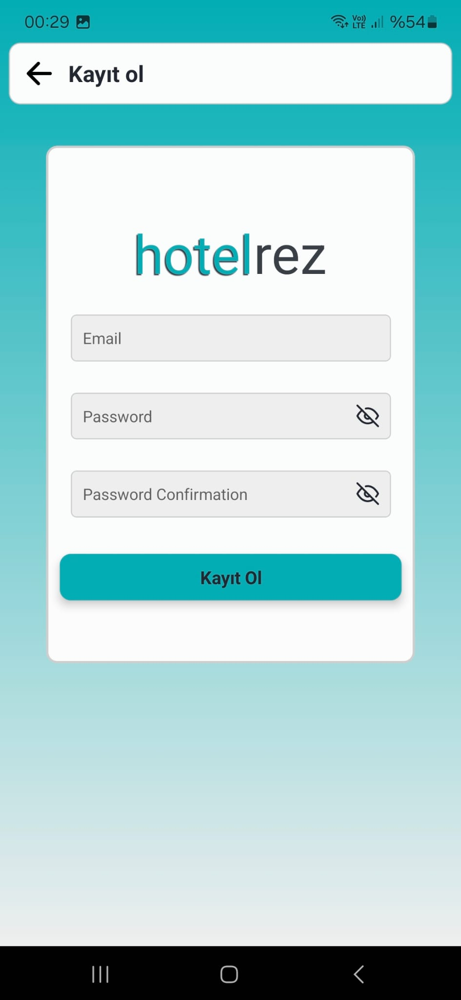
    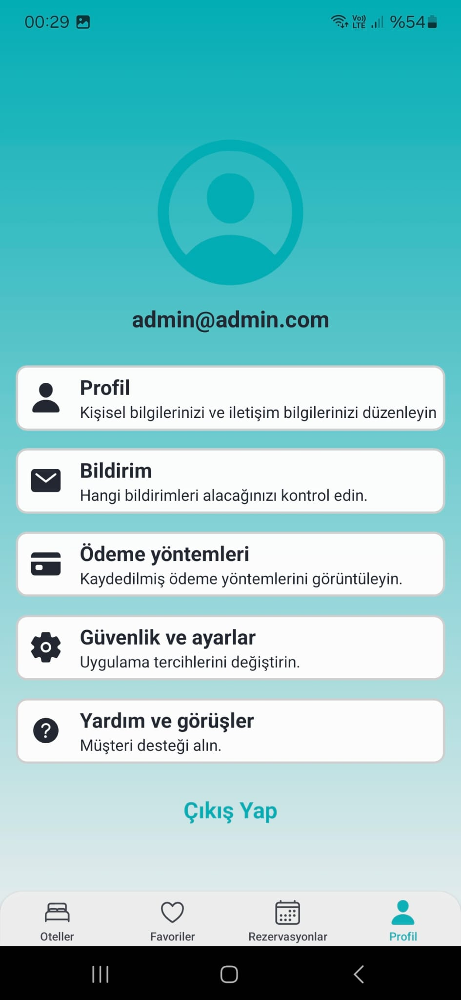
  </p>
  
---

## 🛠️ Kullanılan Teknolojiler

* Frontend: React Native (Expo)
* State Yönetimi: Zustand
* Backend: Firebase (Authentication ve Firestore)
* Navigasyon: React Navigation

---

## 📧 İletişim

Herhangi bir sorunuz veya geri bildiriminiz için bana ulaşabilirsiniz:
E-posta: c.kerem.albayrak@gmail.com
